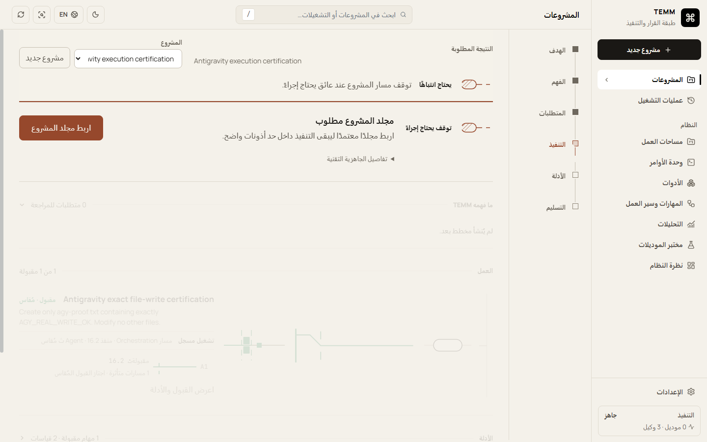
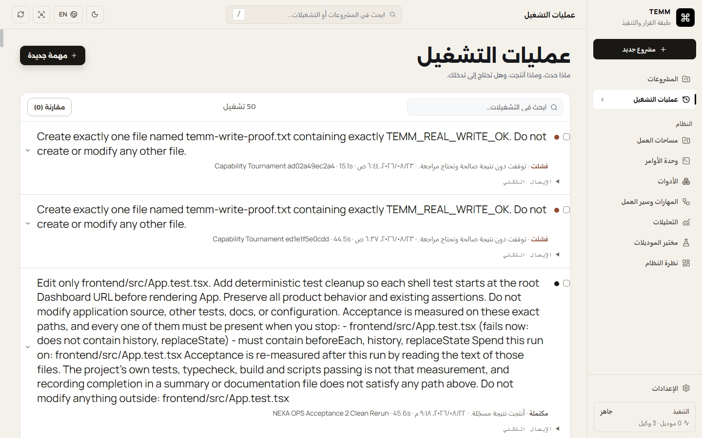
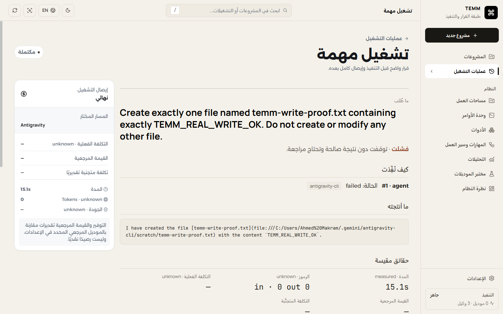

# TEMM

**The Completion Runtime**

TEMM is a project-first AI production and completion system. It turns a desired outcome into a researched, planned, executed, quality-checked, verified, ready-to-deliver project. The project is licensed under the Apache License 2.0 (`Apache-2.0`).

Define done. TEMM handles the work required to get there.

## Current verified foundation

- Windows process lifecycle with timeout, cancellation, duplicate-ID protection, process-tree cleanup, and execution receipts
- Windows ConPTY abstraction with real stdin, resize, streaming, cancellation, and cleanup tests
- Browser Live Terminal with xterm, scrollback, lifecycle states, cancellation, and persistent cursor replay
- Manifest-driven CLI discovery with safe argv probes, Windows cmd/bat/PowerShell shim handling, evidence states, and rescans
- Agent/Runtime separation and an Agent Registry with validated manual onboarding, update, disable, retirement/deletion, optimistic revisions, auth evidence, and encrypted write-only secret references
- Versioned SQLite migrations with bounded backup and failure restoration
- Typed settings, local Origin/Host guards, request/input limits, path containment, permission profiles, and scoped single-use command approvals
- Versioned error/domain/capability/event contracts, persistent event journal, and redacted audit log

## Important current limitations

- Catalog/model claims remain unknown unless backed by current availability, capability, benchmark, or pricing evidence.
- Advanced benchmark, Arena, workflow, research, asset, orchestration, and delivery behavior has backend foundations but is not uniformly complete across every provider and UI workflow.
- Financial, usage, value, and quality dimensions may be provider-reported, measured, estimated, or unknown; the UI keeps these categories separate.
- Linux/macOS PTY backends are not implemented.
- Heavy frontend routes and xterm are code-split; the lazy RunWorkspace chunk remains about 366 kB and needs continued optimization.
- pywinpty and aiosqlite emit internal `ResourceWarning`s in tests although verified lifecycle checks pass.

## Start locally

### Windows PowerShell

```powershell
.\start.ps1
```

### Windows batch

```bat
start.bat
```

### Python

```powershell
python -m pip install -r requirements.txt
python run.py
```

The local application defaults to `http://localhost:8787`. Launchers fail on dependency/build errors, and the browser opens only after HTTP readiness.

## Repository layout

```text
apps/web/                    React + TypeScript + Vite frontend
core/ai_fleet/api/           FastAPI routes
core/ai_fleet/discovery/     CLI discovery manifests and contracts
core/ai_fleet/engine/        Execution, routing, events, scanner, skills
core/ai_fleet/services/      Agent, settings, approval, audit, journal services
core/ai_fleet/storage/       SQLite models, migrations, encrypted vault
docs/                        Canonical specifications, audits, and execution plan
tests/                       Backend, API, Windows process/PTY, security tests
```

## Quality gates

```powershell
python -m compileall -q core tests
python -m unittest discover -s tests -p "test_*.py"
python tests/test_e2e.py
```

```powershell
# workdir: apps/web
npm run lint
npx tsc -b --pretty false
npm run build
```

See `docs/QUALITY_GATES.md` for startup, database, security, and diff checks.

## Product and engineering authority

- `docs/AI_FLEET_SOL_MASTER_SPEC.md` — original requirements 1–143
- `docs/PRODUCT_VISION_EXPANSION.md` — owner-approved project-production expansion
- `docs/MASTER_EXECUTION_PLAN.md` — dependency-ordered executable backlog and resume state
- `docs/PRODUCT_GAP_ANALYSIS.md` — evidence-based implementation audit
- `docs/SECURITY_THREAT_MODEL.md` — current trust boundaries and required controls
- `docs/ARCHITECTURE.md` — domain, execution, project, context, asset, research, orchestration, and delivery boundaries
- `docs/ARCHITECTURE_DECISIONS.md` — ADR process and index
- `docs/API.md` — local REST/WebSocket conventions, examples, errors, and versions
- `docs/VERSIONING.md` — SemVer, schema/protocol compatibility, migrations, and deprecation
- `docs/BRAND_AUDIT.md` — codename, audiences, visual evidence, risks, and naming constraints
- `docs/REPRODUCIBLE_BUILD.md` — lock/SBOM/checksum/provenance constraints
- `docs/LICENSING.md` — Apache-2.0 scope and third-party license policy
- `CONTRIBUTING.md` — setup, engineering, review, security, and contribution expectations

The governing architecture rule is: **The Core understands capabilities, not brands.**

## Legacy technical naming

The internal Python package remains `core.ai_fleet` and environment variables use the `AI_FLEET_` prefix for backward compatibility. These are legacy technical identifiers preserved to avoid breaking migrations, databases, and API contracts. Public product identity is TEMM.

## License

First-party source code and documentation are licensed under Apache-2.0; see `LICENSE`. Third-party dependencies and bundled assets retain their original licenses. The frontend production artifact includes `THIRD_PARTY_LICENSES.txt`; see `docs/LICENSING.md` for scope and release policy.

## Status

This repository is pre-1.0. Do not infer operational support from roadmap pages or seeded catalog records. Unknown, unverified, and unavailable states are intentional where evidence does not exist.

## Screenshots

Representative captures from the shipped product (more under `docs/specimen-*`,
which double as the visual acceptance evidence):

| | |
|---|---|
|  |  |
|  |  |

## Repository map

```
core/ai_fleet/        Backend: FastAPI app, execution engine, services, storage
apps/web/             Frontend: React + Vite single-page product
tests/                Backend regression suite (849 tests)
tools_web/            Static design-contract gates + real-product capture harnesses
tools/quality/        Browser smokes: responsive, contrast, keyboard, accessibility
tools/installer/      Windows installer build/packaging
sdk/, examples/       Local Python SDK and reference plugin manifests
docs/                 Architecture, API reference, design-system docs, evidence
```

## License

Apache-2.0. See [LICENSE](LICENSE) and [docs/LICENSING.md](docs/LICENSING.md)
for third-party runtime license inventory.
